# 13.4 — Chapter 13 in Past Papers: nhận diện dạng và giữ điểm Paper 3

<a id="exam-start"></a>

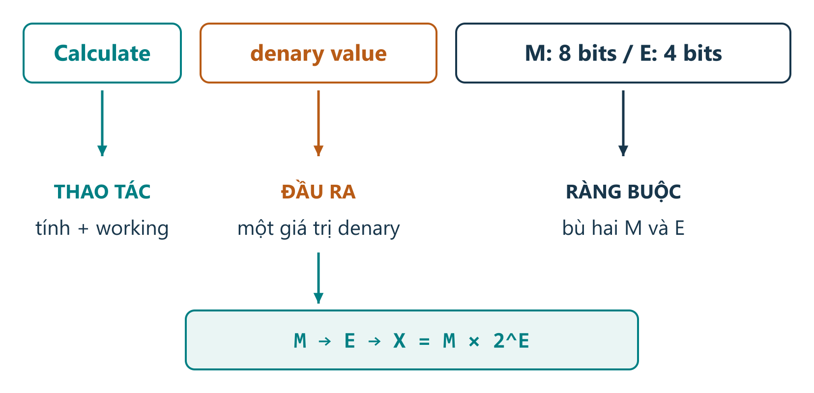


**Mục tiêu:** đọc một câu mới, nhận ra thao tác cần làm, chọn đúng lý thuyết và trình bày đủ bằng chứng để được chấm điểm. Đây là mục ôn thi bổ sung của bộ tài liệu, không phải tên mục 13.4 trong sách hay syllabus.

Phần này hệ thống **19 dạng cốt lõi và 3 dạng giao thoa**, đối chiếu các câu chọn lọc trong **15 cặp QP/MS 9618 giai đoạn 2021–2025**. QP là đề; MS là mark scheme. Mỗi link mở bản PDF tương ứng trong thư mục `exam_sources`. Đây là bản đồ dạng bài, không phải dự đoán câu chắc chắn xuất hiện hoặc thống kê tần suất toàn bộ kho đề.

[Thư viện 26 visual của mục 13.4](exam_visuals/index.html) · [Danh sách hình](exam_visuals/VISUAL_INVENTORY.md).

## 13.4.1 — Nhận diện trong 20 giây

Đọc **động từ yêu cầu → đối tượng → ràng buộc → số điểm**. Gạch chân tên kiểu/biến và dữ kiện số bit. Nếu đề có nhiều ý, phân loại từng ý riêng.

| Dấu hiệu trong câu hỏi | Đi tới dạng |
|---|---|
| Define/describe/compare composite, non-composite | [E01 — Giải thích kiểu](#exam-e01) |
| TYPE từ một danh sách giá trị | [E02 — Enum](#exam-e02) |
| Choose a field/change field to enumerated | [E03 — Chọn/chuyển field](#exam-e03) |
| Declare composite type + danh sách field | [E04 — Định nghĩa record](#exam-e04) |
| Declare a variable/assign values to a record | [E05 — Biến và gán record](#exam-e05) |
| Pointer/memory location/reference | [E06 — Pointer](#exam-e06) |
| SET, unordered elements, union/intersection | [E07 — Set](#exam-e07) |
| Serial/sequential/random organisation | [E08 — Tổ chức tệp](#exam-e08) |
| Search one after another / stop condition | [E09 — Truy cập tuần tự](#exam-e09) |
| Locate a specific record/direct access | [E10 — Index hoặc hash](#exam-e10) |
| MOD, key, hash value, address | [E11 — Tính hash/địa chỉ](#exam-e11) |
| Different keys, same location/collision | [E12 — Va chạm](#exam-e12) |
| Denary number → normalised representation | [E13 — Mã hóa floating-point](#exam-e13) |
| Given M/E → denary value | [E14 — Giải mã](#exam-e14) |
| Normalise a binary number | [E15 — Chuẩn hóa](#exam-e15) |
| Largest/smallest/nearest to zero | [E16 — Giới hạn](#exam-e16) |
| Change number of mantissa/exponent bits | [E17 — Precision/range](#exam-e17) |
| Cannot be stored exactly/approximation | [E18 — Mất chính xác](#exam-e18) |
| Result too large/small/overflow/underflow | [E19 — Ngoài phạm vi](#exam-e19) |
| Record có subrange/array; PRIVATE; SEEK/GETRECORD | [Ba dạng giao thoa](#exam-x01) |

### Động từ quyết định lượng thông tin phải viết

| Yêu cầu | Cách trả lời ngắn nhưng đủ |
|---|---|
| State / identify | Ghi chính xác tên, giá trị hoặc lựa chọn được hỏi |
| Describe | Nêu đặc điểm hoặc các bước cơ chế theo trình tự |
| Explain / justify | Nêu nguyên nhân → hệ quả; gắn với dữ liệu/tình huống đề |
| Compare | Nêu cả hai đối tượng trên cùng tiêu chí; thêm điểm giống nếu phù hợp |
| Calculate / show working | Ghi bước tính trung gian, biểu diễn M/E và kết quả |
| Write pseudocode | Viết đúng loại câu lệnh; giữ tên và cấu trúc đề đã cho |

Không quy đổi máy móc “một dòng = một điểm”. MS có thể gộp nhiều field thành một điểm, giới hạn điểm phương pháp hoặc yêu cầu working cho một đáp án. Các mục “giữ điểm” dưới đây là hành động cần kiểm tra, không bảo đảm tự động đạt điểm tối đa.

## 13.4.2 — Nhóm kiểu dữ liệu

### E01 — Giải thích, phân loại và so sánh kiểu dữ liệu

<a id="exam-e01"></a>

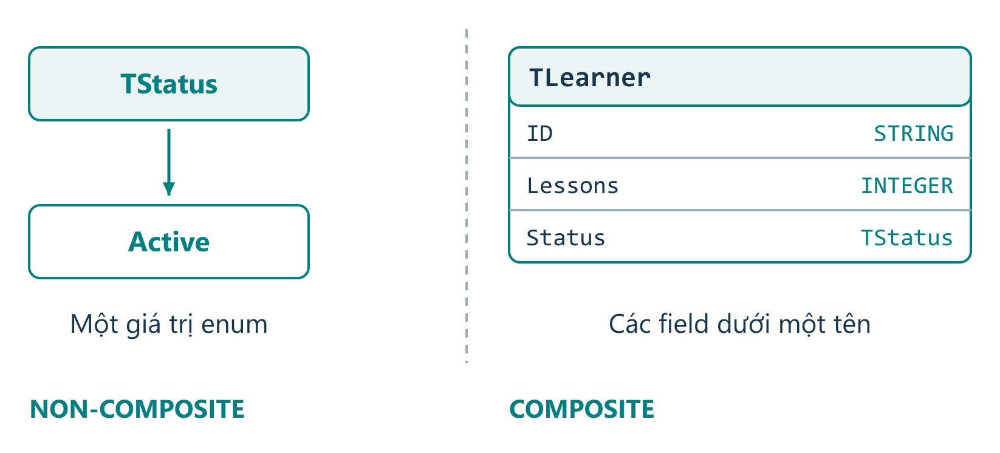


**Nhận diện:** đề hỏi bản chất composite/non-composite, ví dụ hoặc lý do cần user-defined type.

**Giải nhanh:** viết định nghĩa → đặc điểm phân biệt → ví dụ đúng nhóm. Với composite, nhấn mạnh các thành phần được gom dưới một tên; chúng có thể cùng hoặc khác kiểu. Với user-defined, gắn cấu trúc/miền giá trị với bài toán.

**Giữ điểm:** trả lời đủ hai phía khi so sánh. Không viết “composite là có nhiều biến” rồi dừng. Pointer vẫn thuộc non-composite theo phân loại Cambridge; không dùng mẹo nhìn thấy tên kiểu khác là tự chuyển sang composite.

**Bằng chứng chấm:** O/N2023/32 Q2 có 4 điểm, chia tối đa 2 cho mỗi phía. Liệt kê đúng ví dụ nhưng bỏ phần giải thích không thay thế được toàn bộ yêu cầu.

**Lý thuyết:** [G1.1 — Phân loại và mục đích](STUDENT_GUIDE.md#theory-1-1). **Luyện lại:** câu 1,7. **Đề thật:** [QP O/N2023/32 Q2](exam_sources/9618_w23_qp_32.pdf#page=3) · [MS Q2](exam_sources/9618_w23_ms_32.pdf#page=3).

### E02 — Khai báo enum và đặc điểm danh sách giá trị

<a id="exam-e02"></a>

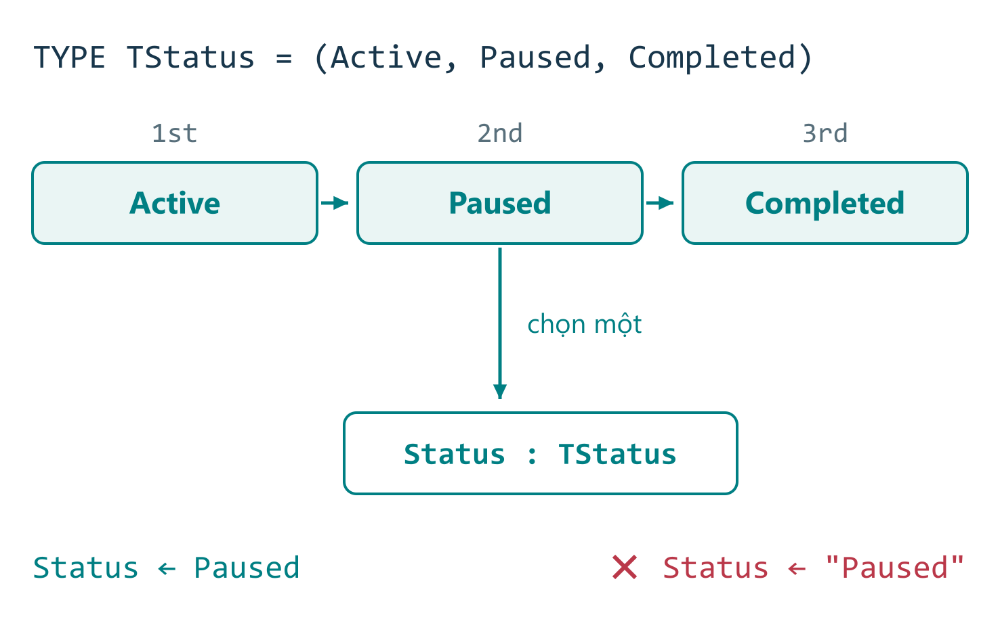


**Nhận diện:** một tên kiểu và danh sách lựa chọn hữu hạn; hoặc hỏi đặc điểm của danh sách enum.

**Giải nhanh:** dùng `TYPE TStatus = (Active, Paused, Completed)`. Kiểm tra tên kiểu, dấu `=`, ngoặc và từng giá trị. Nếu hỏi đặc điểm, chọn các ý độc lập như danh sách có thứ tự khai báo, liệt kê các giá trị hợp lệ, không lặp.

**Giữ điểm:** giá trị enum không đặt trong dấu nháy như STRING. Không dùng DECLARE thay cho TYPE khi đề đang yêu cầu tạo kiểu. Nếu đề chỉ yêu cầu hai đặc điểm, nêu hai ý đúng và rõ; không thêm một ý sai như “enum luôn tự quay vòng”.

**Bằng chứng chấm:** M/J2025/31 Q1(a), 2 điểm, tách phần khai báo kiểu và danh sách. O/N2025/33 Q1(a)(ii) cho điểm các đặc điểm danh sách.

**Lý thuyết:** [G1.2 — Enum](STUDENT_GUIDE.md#theory-1-2). **Luyện lại:** câu 2,29. **Đề thật:** [QP M/J2025/31 Q1(a)](exam_sources/9618_s25_qp_31.pdf#page=2) · [MS](exam_sources/9618_s25_ms_31.pdf#page=6); [QP O/N2025/33 Q1(a)](exam_sources/9618_w25_qp_33.pdf#page=2) · [MS](exam_sources/9618_w25_ms_33.pdf#page=6).

### E03 — Chọn field làm enum hoặc đổi kiểu field

<a id="exam-e03"></a>

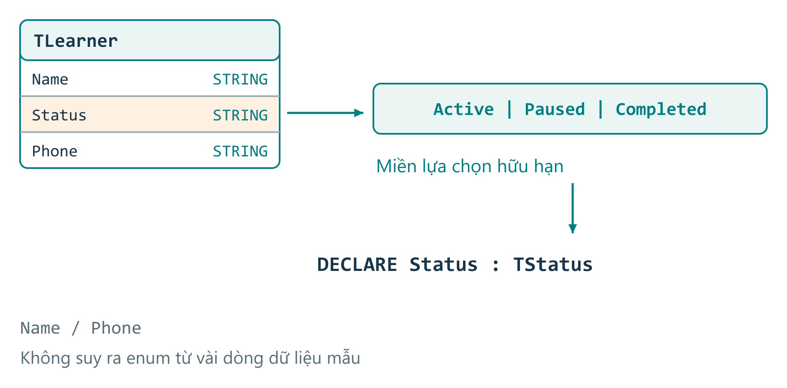


**Nhận diện:** “identify one field”, “give a reason”, hoặc field đang là STRING được chuyển thành enum.

**Giải nhanh:** chọn field có miền lựa chọn hữu hạn ổn định → nêu lý do → nếu yêu cầu sửa code, khai báo enum rồi đổi kiểu field sang tên enum. Ví dụ `DECLARE Status : TStatus`, khi gán dùng `Learner.Status ← Active`.

**Giữ điểm:** “tên ngắn”, “dễ nhớ” không giải thích được vì sao enum phù hợp. Không chọn tên người chỉ vì ví dụ trong bảng chỉ có một tên. Không tạo enum xong vẫn giữ field là STRING. Đọc xem đề yêu cầu **thay một dòng** hay định nghĩa lại cả record.

**Bằng chứng chấm:** M/J2025/33 Q1(b), 2 điểm, một điểm nhận diện field và một điểm lý do. M/J2025/32 Q1(b)(ii) hỏi riêng dòng khai báo field đã đổi kiểu.

**Lý thuyết:** [G1.2](STUDENT_GUIDE.md#theory-1-2), [G1.3 — Field trong record](STUDENT_GUIDE.md#theory-1-3). **Luyện lại:** câu 3–4,28. **Đề thật:** [QP M/J2025/33 Q1(b)](exam_sources/9618_s25_qp_33.pdf#page=2) · [MS](exam_sources/9618_s25_ms_33.pdf#page=6); [QP M/J2025/32 Q1(b)](exam_sources/9618_s25_qp_32.pdf#page=2) · [MS](exam_sources/9618_s25_ms_32.pdf#page=4).

### E04 — Định nghĩa record và chọn kiểu cho từng field

<a id="exam-e04"></a>

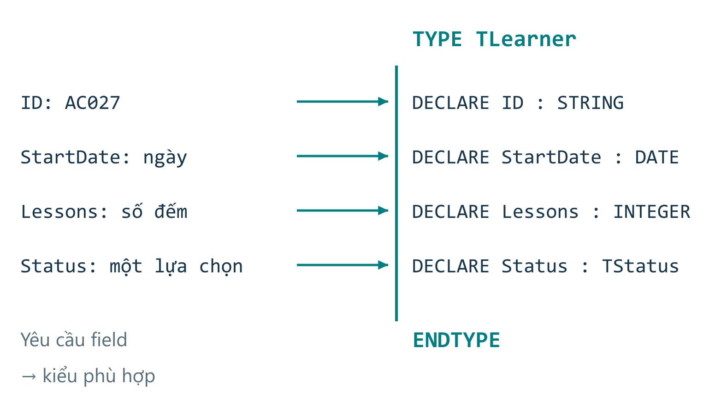


**Nhận diện:** “declare the composite data type” kèm các field, mô tả hoặc dữ liệu mẫu.

**Giải nhanh:** dựng khung trước rồi đi qua từng field như checklist:

```text
TYPE TLearner
   DECLARE ID : STRING
   DECLARE StartDate : DATE
   DECLARE Lessons : INTEGER
   DECLARE Status : TStatus
ENDTYPE
```

**Giữ điểm:** không thiếu ENDTYPE; dùng DECLARE nhất quán; không bỏ field. Mã có chữ/số hoặc điện thoại thường là STRING; số đếm INTEGER; ngày DATE; cờ hai trạng thái BOOLEAN. Nếu đề cho kiểu hoặc ràng buộc cụ thể, tuân theo đề. Dùng đúng enum của ý trước; đừng thay bằng STRING để viết nhanh.

**Bằng chứng chấm:** M/J2025/31 Q1(b), 4 điểm, gồm khung TYPE/ENDTYPE, cách dùng DECLARE và các nhóm field. Không mặc định mỗi field được riêng một điểm.

**Lý thuyết:** [G1.3 — Record](STUDENT_GUIDE.md#theory-1-3). **Luyện lại:** câu 3,28. **Đề thật:** [QP M/J2025/31 Q1(b)](exam_sources/9618_s25_qp_31.pdf#page=2) · [MS](exam_sources/9618_s25_ms_31.pdf#page=6); [QP O/N2024/32 Q3](exam_sources/9618_w24_qp_32.pdf#page=3) · [MS](exam_sources/9618_w24_ms_32.pdf#page=5).

### E05 — Khai báo biến record và gán dữ liệu

<a id="exam-e05"></a>

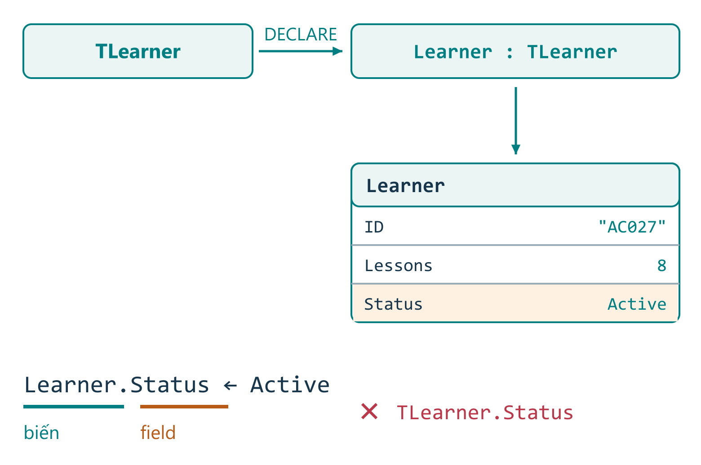


**Nhận diện:** kiểu đã được cho sẵn; đề yêu cầu tạo một record variable hoặc ghi dữ liệu vào biến đã khai báo.

**Giải nhanh:** nếu cần biến mới, `DECLARE Learner : TLearner`; gán bằng `Learner.ID ← "AC027"`. Mỗi dòng tương ứng một field được hỏi.

**Giữ điểm:** bên trái là **tên biến.field**, không phải tên kiểu.field. Nếu đề đã cho tên biến, dùng chính tên đó. STRING có dấu nháy; BOOLEAN/giá trị enum không có. Đừng viết lại TYPE mà bỏ phần gán đề yêu cầu; giữ tên field nhất quán qua các ý.

**Bằng chứng chấm:** M/J2025/32 Q1(a), 3 điểm, xét đúng biến/field, nhóm STRING và DATE. O/N2022/32 Q4(c) tách khai báo biến khỏi phần gán.

**Lý thuyết:** [G1.3](STUDENT_GUIDE.md#theory-1-3). **Luyện lại:** câu 4,28. **Đề thật:** [QP M/J2025/32 Q1(a)](exam_sources/9618_s25_qp_32.pdf#page=2) · [MS](exam_sources/9618_s25_ms_32.pdf#page=4); [QP O/N2022/32 Q4(c)](exam_sources/9618_w22_qp_32.pdf#page=4) · [MS](exam_sources/9618_w22_ms_32.pdf#page=6).

### E06 — Pointer: kiểu, biến, địa chỉ và dereference

<a id="exam-e06"></a>

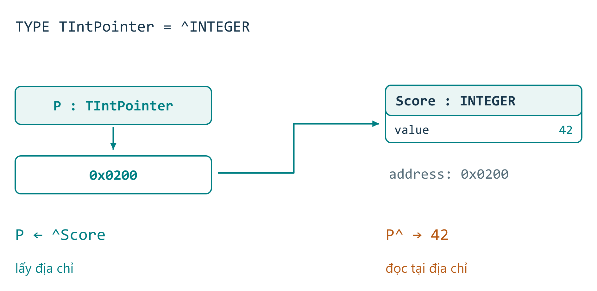


**Nhận diện:** pointer type, reference a memory location, address hoặc giá trị tại địa chỉ.

**Giải nhanh:** xác định **kiểu dữ liệu được trỏ tới** trước. Bốn thao tác khác nhau:

```text
TYPE TStatusPointer = ^TStatus
DECLARE P : TStatusPointer
P ← ^Status
OUTPUT P^
```

**Giữ điểm:** không gắn `^` tùy ý vào mọi chỗ. Dòng TYPE dùng kiểu đích; dòng DECLARE dùng tên pointer type; `^Status` lấy địa chỉ; `P^` đọc giá trị. Nếu đề chỉ hỏi pointer type, dòng đầu là trọng tâm. Biến Status trong ví dụ phải có kiểu TStatus và giá trị hợp lệ trước khi đọc.

**Bằng chứng chấm:** O/N2021/31 Q3(b), 2 điểm, xét cấu trúc pointer declaration và đúng kiểu đích từ ý trước.

**Lý thuyết:** [G1.4 — Pointer](STUDENT_GUIDE.md#theory-1-4). **Luyện lại:** câu 5,30. **Đề thật:** [QP O/N2021/31 Q3(b)](exam_sources/9618_w21_qp_31.pdf#page=3) · [MS](exam_sources/9618_w21_ms_31.pdf#page=4).

### E07 — Mô tả và khai báo SET

<a id="exam-e07"></a>

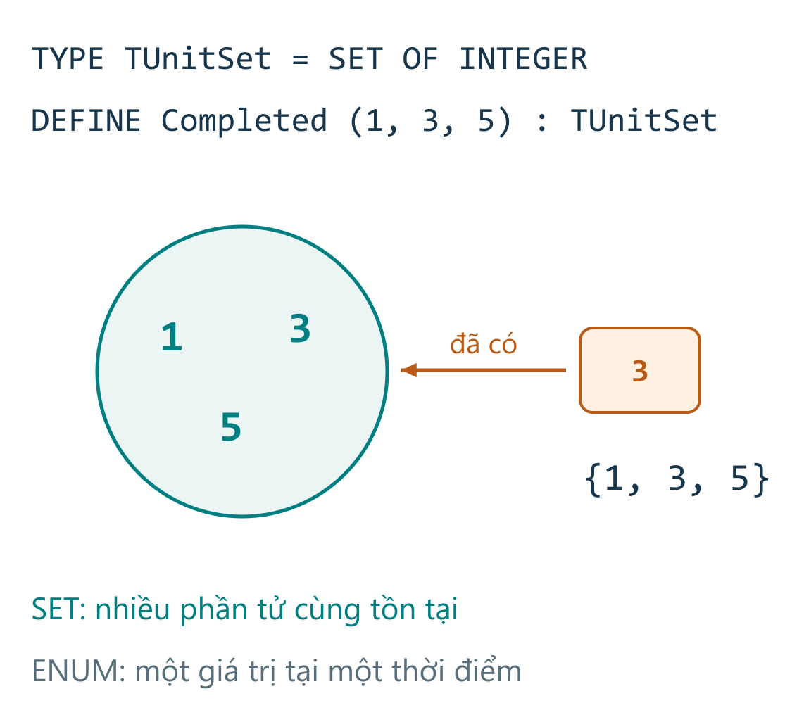


**Nhận diện:** nhiều phần tử có thể cùng có mặt, không thứ tự, cùng kiểu; đề có thể cho cả tên set type và tên biến.

**Giải nhanh:** ghi cả định nghĩa kiểu và tập cụ thể khi đề yêu cầu:

```text
TYPE TUnitSet = SET OF INTEGER
DEFINE Completed (1, 3, 5) : TUnitSet
```

Nếu hỏi mô tả: set là composite; phần tử cùng kiểu, không thứ tự/không lặp; có thể áp dụng hợp/giao.

**Giữ điểm:** không bỏ `SET OF`, `DEFINE`, kiểu sau dấu `:` hoặc tên biến đề chỉ định. CHAR dùng dấu nháy đơn; INTEGER không có nháy. Đừng nhầm set với enum chỉ vì đều liệt kê trong ngoặc.

**Bằng chứng chấm:** M/J2024/32 Q3(b), 4 điểm, đánh giá định nghĩa type, DEFINE, danh sách và liên kết lại set type. O/N2024/31 Q6 bổ sung dạng SET OF CHAR và câu mô tả.

**Lý thuyết:** [G1.5 — Set](STUDENT_GUIDE.md#theory-1-5). **Luyện lại:** câu 6–7, Lab 1. **Đề thật:** [QP M/J2024/32 Q3(b)](exam_sources/9618_s24_qp_32.pdf#page=4) · [MS](exam_sources/9618_s24_ms_32.pdf#page=5); [QP O/N2024/31 Q6](exam_sources/9618_w24_qp_31.pdf#page=5) · [MS](exam_sources/9618_w24_ms_31.pdf#page=7).

## 13.4.3 — Nhóm tổ chức và truy cập tệp

### E08 — So sánh organisation hoặc chọn theo tình huống

<a id="exam-e08"></a>

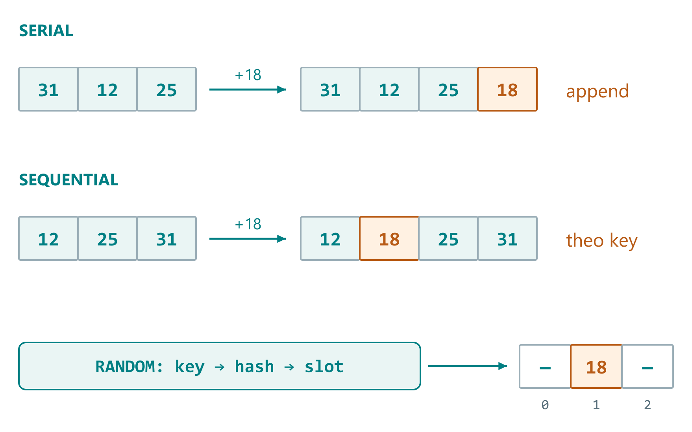


**Nhận diện:** serial/sequential/random **organisation**, thứ tự lưu, cách thêm record hoặc ứng dụng.

**Giải nhanh:** dùng ba cột “thứ tự lưu — cách thêm — tình huống”. Serial theo thứ tự đến, append; sequential theo key, chèn đúng thứ tự; random dùng vị trí tính từ key và xử lý collision. Khi Compare, ghép hai phía trên cùng tiêu chí.

**Giữ điểm:** đề hỏi organisation thì không trả lời chỉ “direct”. Đề hỏi access thì không trả lời chỉ “random”. Nêu tình huống cụ thể và lý do; “nhanh” một mình không thể hiện cơ chế. Sequential file không mặc nhiên chỉ có một cách truy cập.

**Bằng chứng chấm:** O/N2021/31 Q5(a), 4 điểm, có các ý thứ tự lưu, cách thêm và đặc điểm chung. O/N2024/32 Q2 yêu cầu mô tả serial và một ứng dụng.

**Lý thuyết:** [G2.1 — Organisation](STUDENT_GUIDE.md#theory-2-1). **Luyện lại:** câu 9–10,48. **Đề thật:** [QP O/N2021/31 Q5](exam_sources/9618_w21_qp_31.pdf#page=6) · [MS](exam_sources/9618_w21_ms_31.pdf#page=5); [QP O/N2024/32 Q2](exam_sources/9618_w24_qp_32.pdf#page=2) · [MS](exam_sources/9618_w24_ms_32.pdf#page=5).

### E09 — Sequential access và điều kiện dừng

<a id="exam-e09"></a>

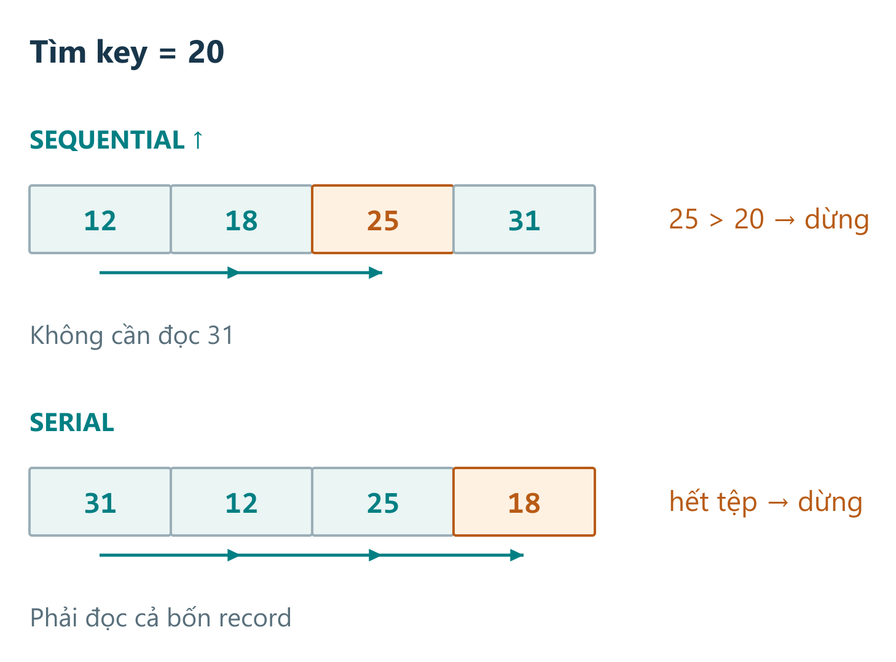


**Nhận diện:** tìm lần lượt; so sánh cách tìm trong serial và sequential file; đề hỏi vì sao có thể dừng sớm.

**Giải nhanh:** bắt đầu đầu tệp → đọc record → so key → tiến tiếp hoặc dừng. Serial: dừng khi tìm thấy hoặc hết tệp. Sequential tăng dần: còn có thể dừng khi key hiện tại lớn hơn key cần tìm. Với `12,18,25,31`, tìm 20 chỉ cần đọc 12,18,25.

**Giữ điểm:** nêu cả điểm bắt đầu lẫn điều kiện kết thúc. Dừng ở key lớn hơn chỉ hợp lệ nếu key được sắp tăng dần. Không nói “sequential nên lấy trực tiếp vị trí thứ 20”. Nếu đề cho thứ tự giảm dần, đảo chiều phép so sánh dừng.

**Bằng chứng chấm:** M/J2024/31 Q4(a) xét đọc lần lượt từ đầu; Q4(b) xét sự khác nhau của điều kiện dừng giữa hai organisation.

**Lý thuyết:** [G2.2 — Access và hit rate](STUDENT_GUIDE.md#theory-2-2). **Luyện lại:** câu 11,31. **Đề thật:** [QP M/J2024/31 Q4](exam_sources/9618_s24_qp_31.pdf#page=4) · [MS](exam_sources/9618_s24_ms_31.pdf#page=7).

### E10 — Direct access: index hay hashing?

<a id="exam-e10"></a>

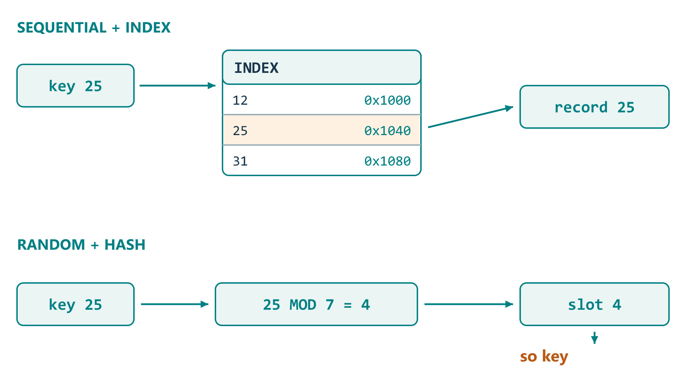


**Nhận diện:** locate a specific record; giải thích direct access cho sequential file và random file.

**Giải nhanh:** sequential có index: **key → tìm trong index → địa chỉ → record**. Random: **key → hash → địa chỉ dự kiến → so key → xử lý collision nếu cần**.

**Giữ điểm:** không chỉ viết “đi thẳng”. Nếu đề nêu hai loại file, viết hai cơ chế riêng. Direct access tránh quét toàn bộ từ đầu, không bảo đảm mọi tìm kiếm chỉ có một lần đọc; collision có thể cần đọc thêm.

**Bằng chứng chấm:** M/J2024/32 Q7(b)(i) có 2 điểm cho index và tra địa chỉ; Q7(b)(ii) xét hash từ key để tính vị trí và có thể xét xử lý record không ở vị trí dự kiến.

**Lý thuyết:** [G2.2](STUDENT_GUIDE.md#theory-2-2), [G2.3](STUDENT_GUIDE.md#theory-2-3). **Luyện lại:** câu 10–11. **Đề thật:** [QP M/J2024/32 Q7](exam_sources/9618_s24_qp_32.pdf#page=8) · [MS](exam_sources/9618_s24_ms_32.pdf#page=8).

### E11 — Tính hash value, slot và địa chỉ

<a id="exam-e11"></a>

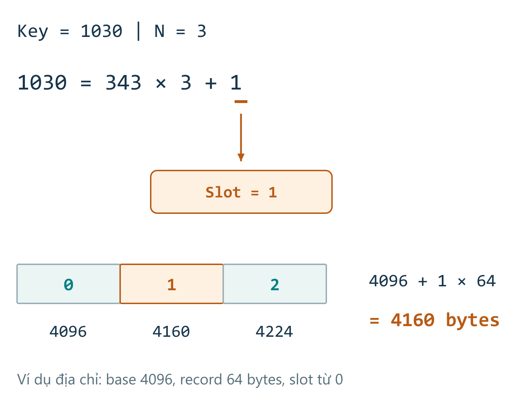


**Nhận diện:** hàm MOD hoặc công thức được cho, bảng record key; đôi khi thêm base address và record size.

**Giải nhanh:** với MOD N, tìm bội của N gần key nhất mà không vượt key, lấy phần dư. Kiểm tra `0 ≤ remainder < N`. Nếu đề yêu cầu địa chỉ và cho mô hình slot 0-based, tính `Base + Slot × RecordSize`.

**Giữ điểm:** MOD không phải thương nguyên. Không nhân record size nếu đề chỉ hỏi hash value. Không tự giả định slot 0-based khi đề đánh số khác; ghi đơn vị địa chỉ đúng. Viết phép tính ngắn để tự soát dù bảng chỉ cần kết quả.

**Bằng chứng chấm:** M/J2023/31 Q3(a), 2 điểm cho hai ô hash còn thiếu; hàm là MOD 3. Đây không phải câu yêu cầu viết một thuật toán hash mới.

**Lý thuyết:** [G2.3 — Hash và địa chỉ](STUDENT_GUIDE.md#theory-2-3). **Luyện lại:** câu 12,32–33. **Đề thật:** [QP M/J2023/31 Q3(a)](exam_sources/9618_s23_qp_31.pdf#page=4) · [MS](exam_sources/9618_s23_ms_31.pdf#page=4).

### E12 — Collision khi lưu và khi tìm

<a id="exam-e12"></a>

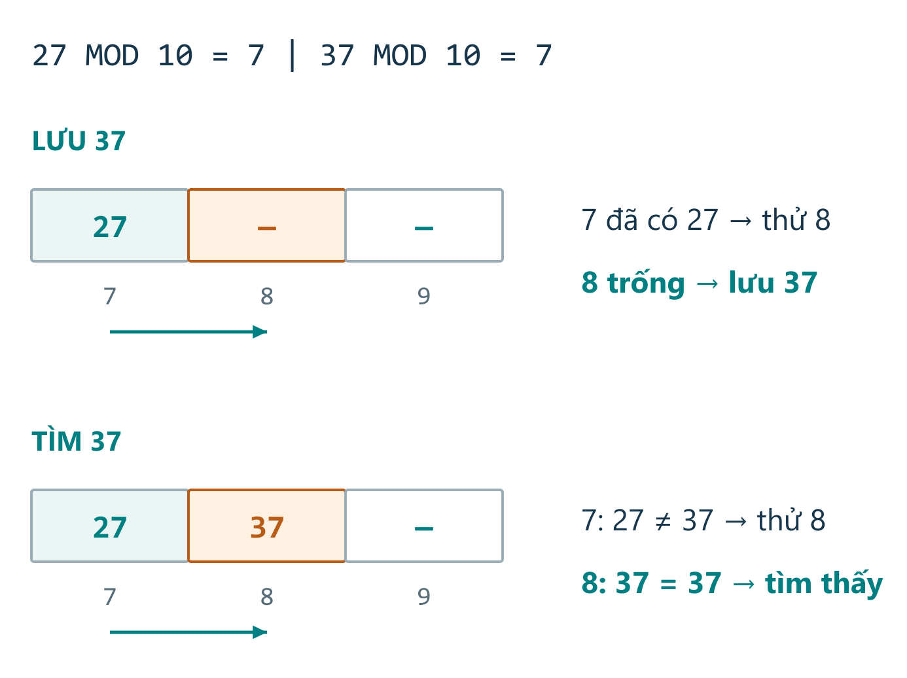


**Nhận diện:** hai key khác nhau cho cùng hash; ô đã có record; đề có thể hỏi storage, retrieval hoặc cả hai.

**Giải nhanh:** mở đầu bằng **khác key nhưng cùng vị trí hash**. Khi lưu: tìm vị trí trống tiếp theo theo quy tắc hoặc vùng tràn, rồi lưu. Khi tìm: hash lại, so key, đi theo cùng đường xử lý collision cho đến khi tìm đúng hoặc đạt điều kiện không tồn tại.

**Giữ điểm:** không ghi đè record cũ; không lấy record đầu tiên chỉ vì hash trùng. Nếu đề hỏi cả storage và retrieval, viết đủ hai nhánh. Khi mô tả linear probing, nêu bắt đầu ở vị trí hash và kiểm tra từng vị trí; không nói chung chung “chọn chỗ khác”.

**Bằng chứng chấm:** M/J2023/31 Q3(b), 4 điểm, có các ý về va chạm, lưu và tìm. O/N2023/32 Q3(b) chấp nhận các cơ chế được mô tả như dò tuyến tính, overflow area hoặc chain. Nhãn open/closed trong các nguồn không nhất quán: diễn tả cơ chế trước, theo thuật ngữ đề nếu được định nghĩa.

**Lý thuyết:** [G2.4 — Collision](STUDENT_GUIDE.md#theory-2-4). **Luyện lại:** câu 13–15,33. **Đề thật:** [QP M/J2023/31 Q3(b)](exam_sources/9618_s23_qp_31.pdf#page=4) · [MS](exam_sources/9618_s23_ms_31.pdf#page=4); [QP O/N2023/32 Q3](exam_sources/9618_w23_qp_32.pdf#page=3) · [MS](exam_sources/9618_w23_ms_32.pdf#page=3).

## 13.4.4 — Nhóm floating-point

### E13 — Denary sang floating-point chuẩn hóa

<a id="exam-e13"></a>

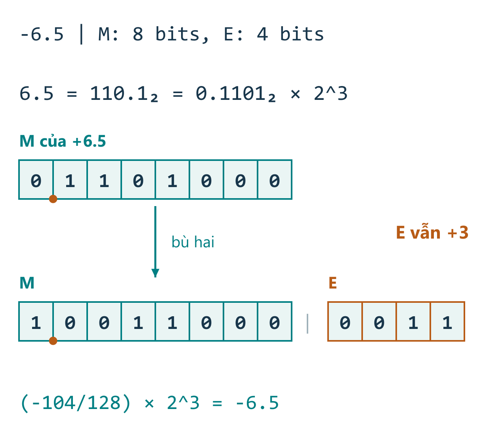

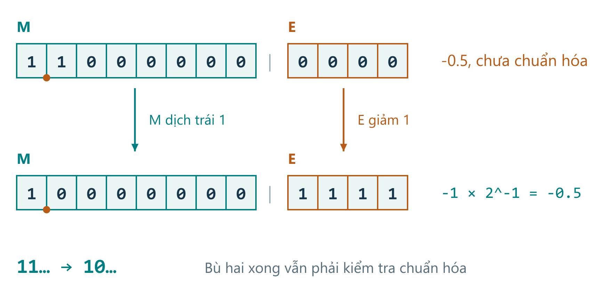


**Nhận diện:** cho số denary và số bit M/E; yêu cầu normalised representation, thường có show working.

**Giải nhanh:** ghi m/e → đổi độ lớn sang binary → đặt dấu chấm để M dương dạng 0.1… và xác định E → đủ m bit → nếu âm thì bù hai M → kiểm tra 01/10 → mã hóa E đủ e bit → đọc ngược. Nếu không đủ M, xử lý phần bỏ theo yêu cầu của câu, không âm thầm đổi số bit.

**Mẫu working ngắn, số luyện mới:** -6.5 trong 8+4: `6.5=110.1₂=0.1101₂×2^3`; M dương 01101000 → bù hai 10011000; E0011; kiểm tra `(-104/128)×8=-6.5`.

**Giữ điểm:** không chỉ đổi sign bit; E không đổi dấu vì X âm. Ghi binary trung gian và sự dịch binary point. Nếu đổi dấu tạo M bắt đầu 11, chuẩn hóa thêm; biên -0.5 là ví dụ cần kiểm tra.

**Bằng chứng chấm:** M/J2025/31 Q2(b), 4 điểm, gồm tối đa 2 điểm working và điểm cho M/E. Một đáp án cuối đúng nhưng không có working không thể thay toàn bộ phần làm việc đề yêu cầu.

**Lý thuyết:** [G3.1 — Quy ước](STUDENT_GUIDE.md#theory-3-1), [G3.3 — Mã hóa](STUDENT_GUIDE.md#theory-3-3). **Luyện lại:** câu 19–20,36,38–39. **Đề thật:** [QP M/J2025/31 Q2(b)](exam_sources/9618_s25_qp_31.pdf#page=3) · [MS](exam_sources/9618_s25_ms_31.pdf#page=7).

### E14 — Floating-point sang denary

<a id="exam-e14"></a>

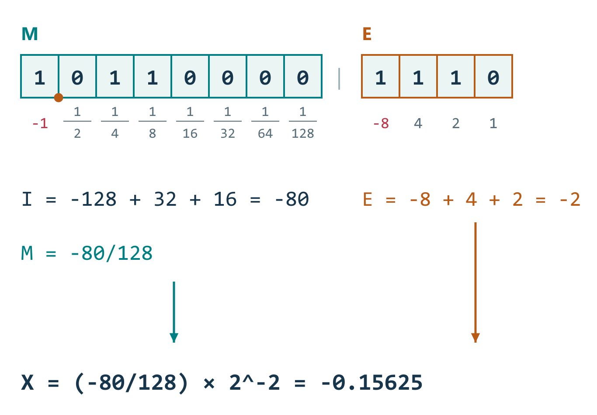


**Nhận diện:** đề cho chuỗi M/E và yêu cầu calculate denary value.

**Giải nhanh:** cách ít phải viết nhiều bit là đọc M như số nguyên bù hai I, rồi dùng `X = I × 2^(E-(m-1))`. Trên bài làm vẫn ghi I hoặc M và E riêng để người chấm thấy cách tính. Cách khác là dịch binary point sau khi đọc E.

**Mẫu ngắn:** 8+4, M10110000/E1110: I=-80, M=-80/128, E=-2, X=-80/512=-0.15625.

**Giữ điểm:** mẫu số mantissa là 2^(m-1), không phải 2^m. E là số nguyên bù hai, không là số không dấu. Bit đầu M có trọng số-1. Nếu M âm và E âm, số vẫn âm; tránh áp dấu âm hai lần.

**Bằng chứng chấm:** M/J2025/32 Q2(b), 3 điểm, gồm 2 điểm working và 1 điểm kết quả. MS chấp nhận cách dịch dấu chấm hoặc tính phân số đúng.

**Lý thuyết:** [G3.2 — Hai cách giải mã](STUDENT_GUIDE.md#theory-3-2). **Luyện lại:** câu 16–18,34–35. **Đề thật:** [QP M/J2025/32 Q2(b)](exam_sources/9618_s25_qp_32.pdf#page=3) · [MS](exam_sources/9618_s25_ms_32.pdf#page=5).

### E15 — Chuẩn hóa và điều chỉnh exponent

<a id="exam-e15"></a>

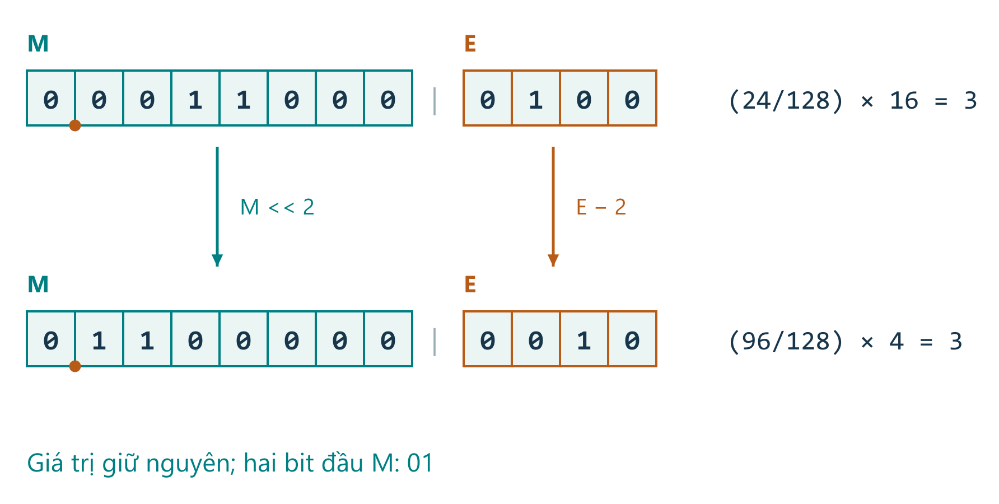

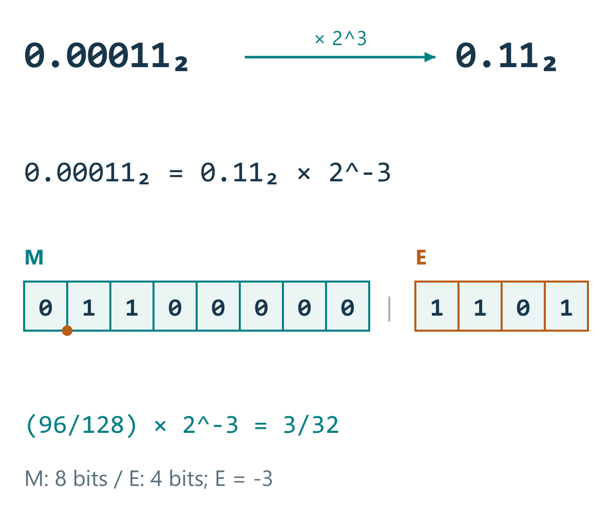


**Nhận diện:** “normalise” có thể cho một chuỗi binary với dấu chấm, hoặc cho sẵn cặp M/E chưa chuẩn hóa. Hai đầu vào này cần cách xác định E ban đầu khác nhau.

**Giải nhanh:** với cặp M/E, dịch M trái k để bắt đầu 01/10, thêm 0 phải và giảm E k. Với binary chưa có cặp M/E, viết `X=M×2^E` từ số lần dịch dấu chấm. Ví dụ `0.00011₂=0.11₂×2^-3`; không tự mặc định E=+3.

**Giữ điểm:** đếm đủ m bit gồm sign bit; kiểm tra E âm bằng bù hai. Nếu chuỗi ban đầu dài hơn dung lượng, phân biệt việc chuẩn hóa với việc mất bit. Chỉ chứng minh giữ nguyên giá trị khi chưa có cắt/làm tròn; không nói chuẩn hóa khôi phục bit đã mất.

**Bằng chứng chấm:** M/J2025/31 Q2(a), 2 điểm, chấm M và E của một binary nhỏ. O/N2021/31 Q1(a) còn hỏi hậu quả khi phần lưu bị cắt: phải gắn giảm precision với các bit thấp bị mất.

**Lý thuyết:** [G3.4 — Normalisation](STUDENT_GUIDE.md#theory-3-4), [G3.6 — Sai số](STUDENT_GUIDE.md#theory-3-6). **Luyện lại:** câu 21–22,40. **Đề thật:** [QP M/J2025/31 Q2(a)](exam_sources/9618_s25_qp_31.pdf#page=3) · [MS](exam_sources/9618_s25_ms_31.pdf#page=7); [QP O/N2021/31 Q1](exam_sources/9618_w21_qp_31.pdf#page=2) · [MS](exam_sources/9618_w21_ms_31.pdf#page=3).

### E16 — Số lớn nhất, nhỏ nhất và gần 0 nhất

<a id="exam-e16"></a>

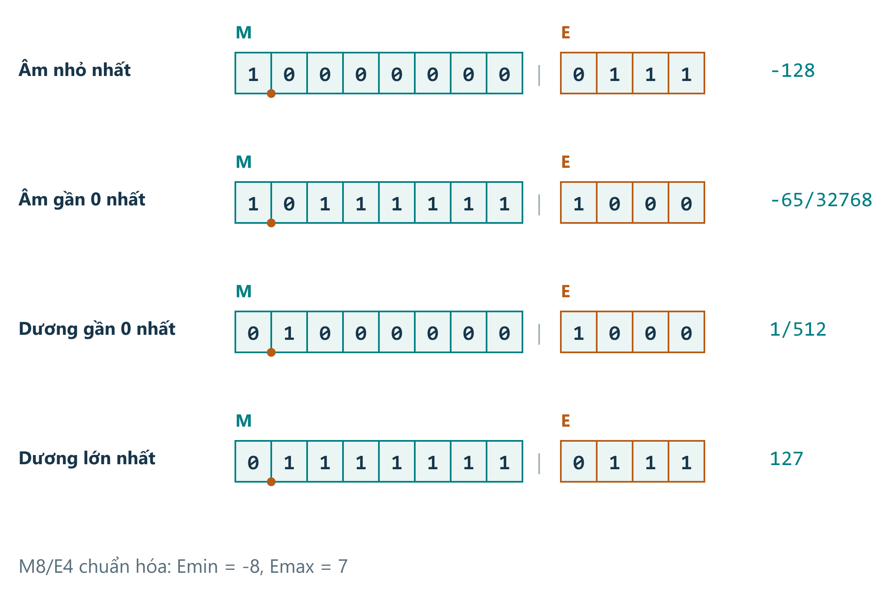


**Nhận diện:** largest positive, smallest positive, largest magnitude negative hoặc nearest to zero; có thể yêu cầu cả binary lẫn denary dưới dạng lũy thừa 2.

**Giải nhanh:** viết Emax=`2^(e-1)-1`, Emin=`-2^(e-1)`, rồi chọn M theo yêu cầu:

| Yêu cầu trong mô hình chuẩn hóa | M | E |
|---|---|---|
| Dương lớn nhất | 0 rồi toàn 1 | Emax |
| Dương nhỏ nhất | 01 rồi toàn 0 | Emin |
| Âm có độ lớn lớn nhất | 1 rồi toàn 0 | Emax |
| Âm gần 0 nhất | 10 rồi toàn 1 | Emin |

**Giữ điểm:** “âm nhỏ nhất” và “âm có độ lớn nhỏ nhất” không cùng nghĩa. E lớn nhất có bit dấu 0; không điền toàn 1. Nếu đề chỉ hỏi positive thì không tốn thời gian liệt kê cả bảng. Nếu yêu cầu denary theo powers of 2, giữ phân số/lũy thừa chính xác thay vì xấp xỉ dài.

**Bằng chứng chấm:** M/J2025/33 Q2(a), 2 điểm, yêu cầu bit pattern và giá trị denary. Với 8+8, kết quả dương lớn nhất là `(127/128)×2^127`.

**Lý thuyết:** [G3.5 — Bốn giới hạn](STUDENT_GUIDE.md#theory-3-5). **Luyện lại:** câu 23,41. **Đề thật:** [QP M/J2025/33 Q2(a)](exam_sources/9618_s25_qp_33.pdf#page=3) · [MS](exam_sources/9618_s25_ms_33.pdf#page=7).

### E17 — Thay đổi số bit mantissa/exponent

<a id="exam-e17"></a>

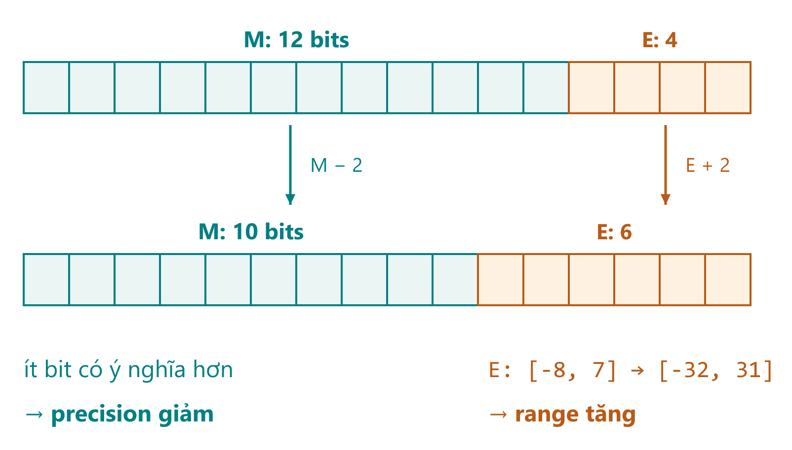


**Nhận diện:** thay số bit một phần, tổng word giữ nguyên; compare precision/range hoặc biểu diễn cùng số trên hai hệ.

**Giải nhanh:** viết bảng `M cũ/E cũ → M mới/E mới`; tính phần còn lại từ tổng bit. Sau đó viết hai chuỗi nguyên nhân–hệ quả: M giảm → ít bit có ý nghĩa → precision giảm; E tăng → miền E rộng hơn → range rộng hơn.

**Giữ điểm:** phải nêu cả precision lẫn range nếu đề hỏi hiệu ứng của phân bổ. Không kết luận tăng E giúp lưu mọi phần lẻ chính xác. Nếu tổng word không được giữ cố định, không tự suy ra M tăng thì E phải giảm.

**Bằng chứng chấm:** O/N2025/33 Q2(a), 3 điểm, khi M từ 12 xuống 10 trong word 16 bit: precision giảm; E tăng lên 6; range tăng. Đó là ba ý khác nhau.

**Lý thuyết:** [G3.5](STUDENT_GUIDE.md#theory-3-5). **Luyện lại:** câu 25,42. **Đề thật:** [QP O/N2025/33 Q2(a)](exam_sources/9618_w25_qp_33.pdf#page=3) · [MS](exam_sources/9618_w25_ms_33.pdf#page=7); [QP M/J2023/31 Q1](exam_sources/9618_s23_qp_31.pdf#page=2) · [MS](exam_sources/9618_s23_ms_31.pdf#page=3).

### E18 — Không lưu chính xác, truncation và rounding

<a id="exam-e18"></a>

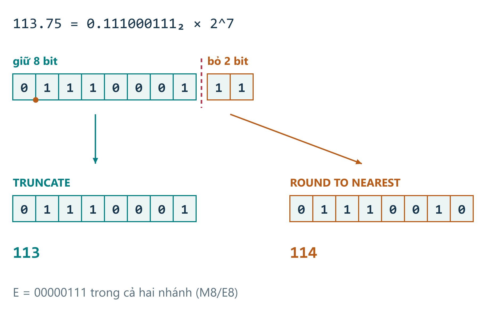


**Nhận diện:** “cannot be represented exactly”, “approximation”, số binary dài hơn M, hoặc so sánh kết quả hai hệ.

**Giải nhanh:** xác định lý do đúng: (1) dãy binary vô hạn; (2) dãy hữu hạn nhưng vượt số bit M; hoặc (3) vượt range — đây là vấn đề khác. Với thiếu M, viết mantissa chuẩn hóa cần bao nhiêu bit, phần giữ/bỏ và giá trị thực được lưu.

**Giữ điểm:** không giải thích mọi sai số bằng “số có dấu chấm”. Không tự round-to-nearest khi câu đang yêu cầu/cách chấm thể hiện truncation. M/J2023/31 Q1 dùng 113.75, là số có binary hữu hạn; hệ M8 thiếu bit nên cắt mất phần thấp. Với số âm, bỏ bit bù hai và làm tròn về 0 không đồng nghĩa.

**Bằng chứng chấm:** M/J2023/31 Q1(b), 2 điểm, liên kết thiếu số bit của mantissa với precision bị mất. O/N2024/31 Q1(a) cho thấy một câu “calculate representation” vẫn có thể dẫn tới mất bit; phải đọc cả số và dung lượng, không giả định luôn lưu chính xác.

**Lý thuyết:** [G3.3 — Tạo bit phần lẻ](STUDENT_GUIDE.md#theory-3-3), [G3.6 — Rounding và tích lũy](STUDENT_GUIDE.md#theory-3-6). **Luyện lại:** câu 24,27,43–46. **Đề thật:** [QP M/J2023/31 Q1](exam_sources/9618_s23_qp_31.pdf#page=2) · [MS](exam_sources/9618_s23_ms_31.pdf#page=3); [QP O/N2024/31 Q1](exam_sources/9618_w24_qp_31.pdf#page=2) · [MS](exam_sources/9618_w24_ms_31.pdf#page=4).

### E19 — Overflow, underflow và hậu quả

<a id="exam-e19"></a>

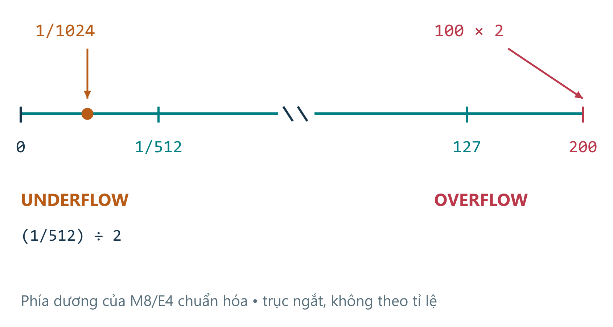


**Nhận diện:** yêu cầu nêu tình huống, giải thích xảy ra khi nào hoặc hậu quả của kết quả quá lớn/quá nhỏ.

**Giải nhanh:** dùng khung **phép tính → kết quả → so với giới hạn → không biểu diễn được theo định dạng**. Trong 8+4 chuẩn hóa:100× 2=200>127 là overflow; (1/512)/2=1/1024 quá gần 0 là underflow.

**Giữ điểm:** underflow không phải “ra số âm”. Overflow không chỉ là “có carry”. Nếu đề hỏi tình huống và hậu quả thì phải có cả hai. Không khẳng định mọi hệ thống đều tự trả 0; hành vi xử lý phụ thuộc hệ thống. Chia cho 0 cần được phân biệt với phép tính hữu hạn vượt range.

**Bằng chứng chấm:** O/N2025/33 Q2(b), 3 điểm, xét phép tính có thể xảy ra, kết quả ngoài range và hậu quả không giữ được biểu diễn hợp lệ. O/N2022/32 Q1(c) hỏi thời điểm underflow xảy ra. Số 0 theo quy ước riêng được ôn ở G3.4/3.7; không gán cho nó một câu past paper riêng chưa xác minh trong danh sách này.

**Lý thuyết:** [G3.7 — Ngoài phạm vi](STUDENT_GUIDE.md#theory-3-7), [G3.5 — Giới hạn](STUDENT_GUIDE.md#theory-3-5). **Luyện lại:** câu 26–27,47. **Đề thật:** [QP O/N2025/33 Q2(b)](exam_sources/9618_w25_qp_33.pdf#page=3) · [MS](exam_sources/9618_w25_ms_33.pdf#page=7); [QP O/N2022/32 Q1(c)](exam_sources/9618_w22_qp_32.pdf#page=2) · [MS](exam_sources/9618_w22_ms_32.pdf#page=4).

## 13.4.5 — Ba dạng giao thoa cần nhận ra

### X01 — Record có subrange hoặc array field

<a id="exam-x01"></a>

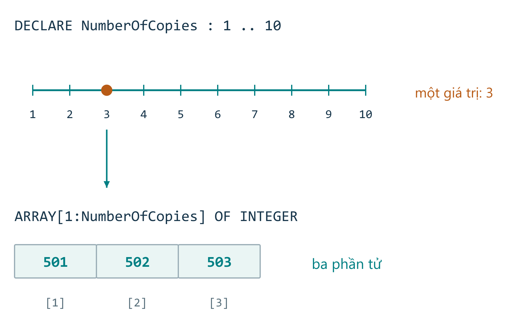


**Nhận diện:** ràng buộc field trong một khoảng hoặc mỗi record phải chứa nhiều mã con.

**Giải nhanh:** phân biệt “một giá trị bị giới hạn” với “một danh sách nhiều phần tử”. M/J2022/31 Q1(b)(i) dùng subrange `1..10`; (ii) dùng array các số nguyên với số phần tử phụ thuộc NumberOfCopies.

**Giữ điểm:** đây không phải câu SET chỉ vì có nhiều accession number. Viết đúng **dòng thay/được thêm** theo câu hỏi. Subrange là cách khai báo xuất hiện ở đề cũ này; dùng để đọc đúng đề và mark scheme của nó, không tự suy ra là một kiểu cốt lõi mới của mục 13.1 hiện hành.

**Lý thuyết liên quan:** [G1.3 — Record và array](STUDENT_GUIDE.md#theory-1-3); phần array/range của AS. **Đề thật:** [QP M/J2022/31 Q1(b)](exam_sources/9618_s22_qp_31.pdf#page=2) · [MS](exam_sources/9618_s22_ms_31.pdf#page=4).

### X02 — Record chuyển sang class và PRIVATE

<a id="exam-x02"></a>

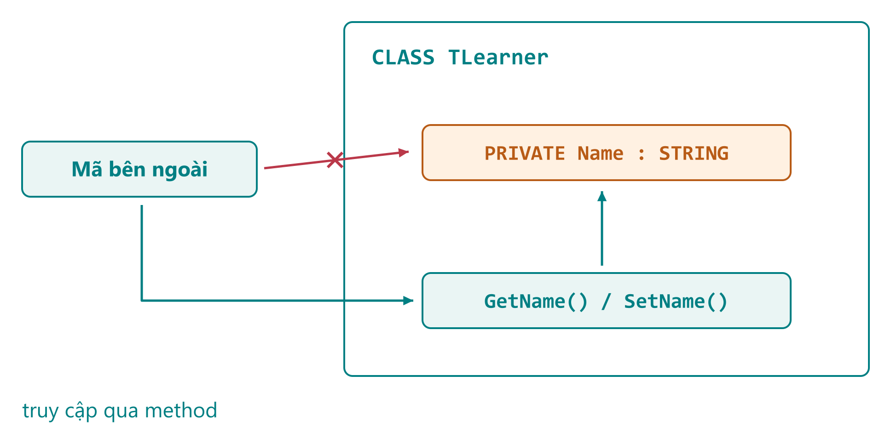


**Nhận diện:** đầu câu là record nhưng ý tiếp theo chuyển sang OOP/class/properties/PRIVATE.

**Giải nhanh:** xác định property và kiểu; viết `PRIVATE Name : STRING` nếu phù hợp yêu cầu. Khi giải thích, nối hạn chế truy cập trực tiếp bên ngoài với việc dữ liệu được truy cập qua method của class, thể hiện encapsulation.

**Giữ điểm:** không đáp “PRIVATE để mã hóa dữ liệu” hoặc “để mọi chương trình không đọc được”. Nếu đề hỏi 1 dòng, không mất thời gian viết lại cả class. Phần method, inheritance, polymorphism sâu hơn thuộc ôn OOP, không chỉ học lại record.

**Lý thuyết:** [G1.6 — Class/object](STUDENT_GUIDE.md#theory-1-6); nối sang Unit 20 khi câu hỏi vượt mẫu đơn giản. **Luyện lại:** câu 8. **Đề thật:** [QP M/J2022/32 Q1(c)](exam_sources/9618_s22_qp_32.pdf#page=3) · [MS](exam_sources/9618_s22_ms_32.pdf#page=4).

### X03 — Điền pseudocode xử lý random file

<a id="exam-x03"></a>

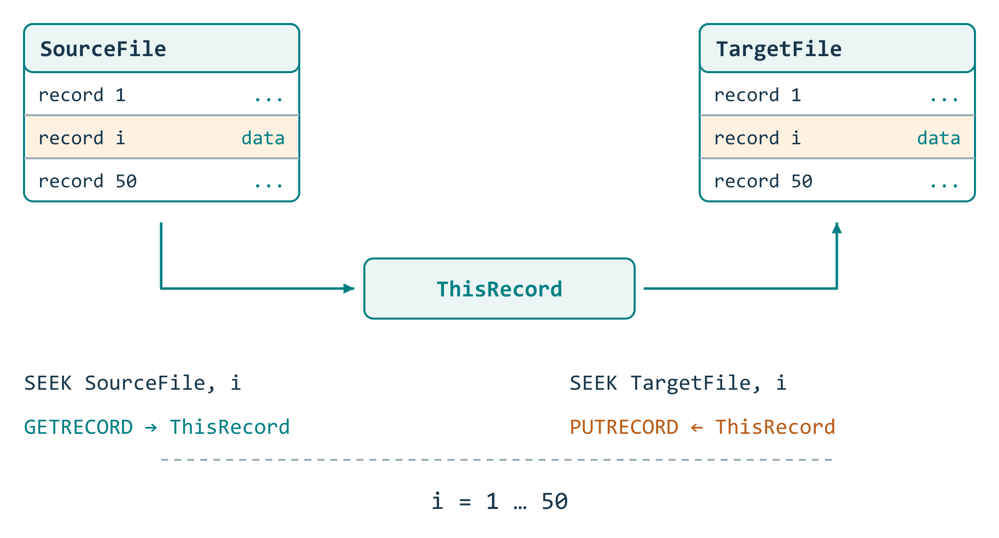


**Nhận diện:** OPENFILE/RANDOM, SEEK, GETRECORD, PUTRECORD, vòng lặp và record variable. Đây là thao tác lập trình trên tệp, không chỉ định nghĩa organisation.

**Giải nhanh:** đọc từ trên xuống, ghi vai trò từng chỗ trống: **mở đúng file → điều khiển vị trí → SEEK → đọc/ghi đúng hướng → kiểm tra → tăng vị trí → đóng**. Sao chép giữa hai file cần SEEK đúng file nguồn khi đọc và đúng file đích khi ghi.

**Giữ điểm:** GETRECORD đọc vào biến; PUTRECORD ghi từ biến. Không nhầm filename với record variable. Giữ số record và biên vòng lặp trong đề. Khi tìm chỗ trống, phải phân biệt đã lưu với hết file/bảng đầy; không bỏ biến trạng thái Stored.

**Bằng chứng chấm:** M/J2025/32 Q13 có 5 điểm cho 5 dòng điền khi sao chép 50 record; M/J2025/33 Q11 có 5 điểm cho các dòng điền khi tìm chỗ trống. M/J2023/32 Q6(b) là bước nối từ định nghĩa record sang đọc file.

**Lý thuyết liên quan:** [G1.3 — Record](STUDENT_GUIDE.md#theory-1-3), [G2.2 — Access](STUDENT_GUIDE.md#theory-2-2), [G2.4 — Điều kiện dừng](STUDENT_GUIDE.md#theory-2-4); thêm thao tác file của phần Further Programming. **Đề thật:** [QP M/J2025/32 Q13](exam_sources/9618_s25_qp_32.pdf#page=13) · [MS](exam_sources/9618_s25_ms_32.pdf#page=12); [QP M/J2025/33 Q11](exam_sources/9618_s25_qp_33.pdf#page=13) · [MS](exam_sources/9618_s25_ms_33.pdf#page=14); [QP M/J2023/32 Q6](exam_sources/9618_s23_qp_32.pdf#page=7) · [MS](exam_sources/9618_s23_ms_32.pdf#page=7).

## 13.4.6 — Bốn mẫu trả lời để giữ điểm

**Mẫu giải thích 2 ý:** “Mantissa có ít bit hơn, nên không giữ được toàn bộ các bit có ý nghĩa; phần thấp bị bỏ/làm tròn khiến precision giảm.” Thay vào dữ kiện đề, không viết câu chung khi đề yêu cầu số bit cụ thể.

**Mẫu compare:** “Cả hai lưu record lần lượt. Serial theo thứ tự đến và thêm cuối; sequential theo key và chèn đúng thứ tự.” Nếu đề còn hỏi access, bổ sung riêng cơ chế tìm.

**Mẫu collision:** “Hai key khác nhau cho cùng hash nên vị trí dự kiến có thể đã bị chiếm. Khi ghi, dò đến ô trống theo quy tắc; khi đọc, so key ở từng vị trí trên cùng đường dò.” Đổi sang overflow area nếu đề yêu cầu cơ chế đó.

**Mẫu show working:** ghi bốn dòng `quy ước m/e → giá trị binary hoặc M → E → kết quả và kiểm tra`. Không xóa working đúng chỉ vì đáp án cuối đã nằm trong ô.

### Kiểm tra 30 giây trước khi chuyển câu

<a id="exam-review"></a>

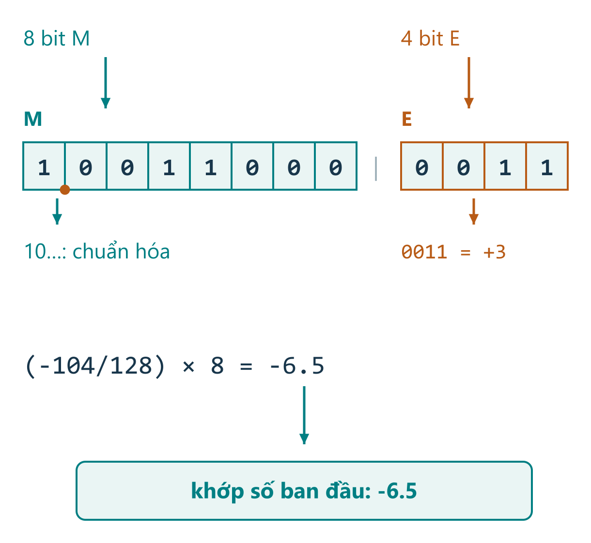


- Tôi có trả lời đúng thao tác: **TYPE / DECLARE / gán**, hay **organisation / access**?
- Tên biến/field, kiểu enum từ ý trước và các dấu nháy có nhất quán?
- M/E đủ số bit; E đã đọc/mã hóa bù hai; mantissa đã chuẩn hóa khi được yêu cầu?
- Tôi có ghi working và các phần câu hỏi yêu cầu, thay vì chỉ kết quả?
- Khi mất bit/collision/ngoài range, tôi có giải thích nguyên nhân và hệ quả cụ thể?

## 13.4.7 — Cách dùng mục này để ôn thi

1. Chọn một QP, che MS; ghi mã dạng E/X trước khi giải.
2. Tự giải với thời gian dự kiến theo số điểm. Đây là luyện phân bổ thời gian cá nhân, không áp một số phút cố định cho mọi câu.
3. So với MS đúng mã đề/variant/kỳ thi; đánh dấu ý được chấm và ý mình thiếu.
4. Quay lại link G tương ứng, làm câu luyện nội bộ rồi thử một câu khác cùng dạng.
5. Ghi lỗi: **nhận sai dạng / thiếu kiến thức / sai thao tác / thiếu working / thiếu ý theo đề**. Ưu tiên sửa lỗi lặp lại trước khi làm thêm nhiều đề.

Các ví dụ mẫu trong mục này để học cách trình bày. Một QP đã mở MS hoặc được chữa trên lớp không còn là đề thử chưa từng xem. [Danh sách nguồn đã đối chiếu](EXAM_SOURCE_REGISTER.md) ghi phạm vi, trang nguồn và các lưu ý thuật ngữ để giáo viên kiểm tra lại.
