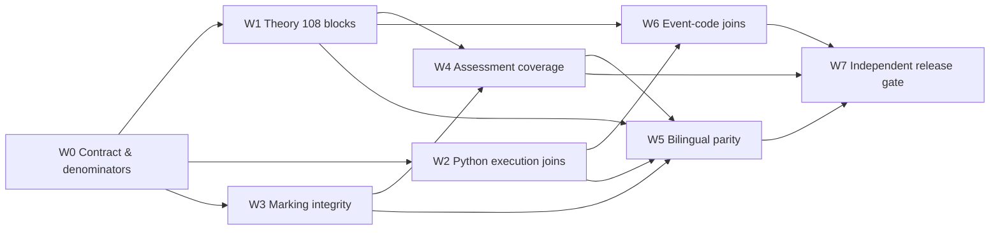

# Paper 4 — Content gap review và kế hoạch giai đoạn tiếp theo

Ngày rà soát: 22/09/2026. Phạm vi: Stage 0–9, tập trung vào kiến thức, Python, nguồn syllabus/coursebook, evidence chạy code, song ngữ và integrity của phương pháp làm bài/chấm điểm. Báo cáo này không sửa app hoặc trạng thái release hiện tại.

## Kết luận Lead cần dùng

**Giữ Stage 9 ở `REWORK_REQUIRED`.** Không cần làm lại toàn bộ Stage 0–5. Các stage đó chứa corpus và mô hình nguồn tốt; khoảng trống phát sinh khi nội dung được biên soạn và tích hợp ở Stage 6–9.

Ba vấn đề chặn release tiếp theo:

1. Stage 3 có **108 knowledge blocks**, nhưng website chỉ có **26 knowledge summaries**; **0/108** block được giữ thành đơn vị có ID và anchor riêng.
2. Stage 5 đã kiểm chứng **4.881 obligations**, nhưng **0/26** worked example trên website dẫn tới author run hoặc independent rerun.
3. Stage 4 có marking design cho **58/58 patterns** và **2.236 marking atoms**, nhưng marking block trên website chỉ có QP+MS trực tiếp ở **12/26 lessons**, tương ứng **32/58 pattern IDs**.

Phần Python đã tiến bộ sau post-release remediation: **26/26 lessons** có structured Python và semantic code rendering. Tuy nhiên chỉ **1/26 lessons** đạt gate độ sâu lý thuyết hiện tại. Code hiển thị chưa có provenance chạy được kiểm chứng.

## Snapshot có thể kiểm chứng

| Lớp dữ liệu | Nguồn đã có | Trạng thái xuất bản |
|---|---:|---:|
| Corpus | 29 QP/MS, 87 câu, 672 scored parts, 2.175 điểm | Baseline dùng được |
| Taxonomy | 58 patterns | 58/58 pattern IDs có trong registry |
| Course structure | 13 packages, 26 lessons | 13/13 và 26/26 có route |
| Knowledge | 108 blocks, 55 book sections | 26 summaries; 0/108 block giữ ID/anchor riêng |
| Syllabus | 111 objectives; 107 mapped, 4 excluded có lý do | 0 direct `SYL-*` locator trong registry |
| Coursebook joins | 108/108 blocks có locator | 0 exact Stage-3 knowledge→book join; chỉ có 2 incidental refs ở `binary-tree` |
| Method | 58 cards, 272 method steps | Có method summaries, chưa chứng minh đủ chain theo từng pattern |
| Marking | 2.236 atoms, 58/58 patterns có refs | QP+MS trực tiếp ở 12/26 lessons; 32/58 pattern IDs |
| Execution | 4.881 obligations, 58 worked-example specs | 0/26 published execution joins |
| Practice | 107 requirements, 37 destinations | 78 items: 26 guided + 26 faded + 26 independent; 63 có stable ID, 15 chưa có; 0 requirement IDs |
| Visual | 58 patterns, 174 scenarios, 331 events | Runtime dùng được; cần nối lại code-line IDs |
| Song ngữ | Contract yêu cầu parity đầy đủ | 260/260 blocks có VI+EN; 257/260 cùng cấu trúc |

Ba lỗi parity cấu trúc đã xác định nằm ở Action View của `random-files`, `exceptions` và `performance`: hàng tiếng Việt có 3 ô trong khi header có 4 cột, đồng thời dữ liệu VI/EN không cùng fixture.

## Đánh giá từng stage

| Stage | Quyết định | Việc cần làm tiếp |
|---|---|---|
| 0 | Giữ | Contract hiện tại đúng và đủ nghiêm ngặt. |
| 1 | Giữ | Corpus 2021–2025 là baseline đã kiểm chứng. |
| 2 | Giữ | Taxonomy 58 dạng phủ 672 scored parts; bảo toàn nhãn 20 dạng limited-evidence. |
| 3 | Giữ mô hình, bắt đầu authoring | Artefact ghi rõ `PLANNED_NOT_AUTHORED`; dùng 108 blocks làm denominator bắt buộc. |
| 4 | Giữ design, phục hồi traceability | Đưa method/marking chain theo pattern vào sản phẩm học; không đổ 2.236 atoms lên UI. |
| 5 | Giữ evidence, xây join | Hash đúng code đang hiển thị và nối tới run/rerun tương ứng. |
| 6 | Recompose | Xây lại learning objects để không nén 108 blocks thành 26 đoạn. |
| 7 | Giữ event spec, thêm line join | Mọi event có `codeLines` phải trỏ tới dòng Python thật. |
| 8 | Giữ runtime, reverify | Chạy lại sau khi content/code thay đổi; visual không thay thế theory hay execution evidence. |
| 9 | Rework | Chỉ tạo replacement release sau independent end-to-end QA. |

## Kế hoạch điều phối

### W0 — Khóa denominator và schema traceability (`P0`)

**Agents:** A0 Lead + A8 independent QA. **Phụ thuộc:** không.

Lead tạo crosswalk bất biến cho 26 lessons, 58 patterns, 108 knowledge blocks, 107 requirements, 37 assessment destinations và 58 Stage 5 worked examples. Schema bắt buộc có stable ID, authority class, source locator và version/hash.

Gate: mọi denominator khớp upstream; validator phải chủ động fail khi thiếu ID, locator hoặc authority; A8 tái tạo độc lập toàn bộ count.

### W1 — Biên soạn 108 knowledge blocks (`P0`)

**Agents:** A1 syllabus/coursebook editor + A4 bilingual pedagogy editor. **Phụ thuộc:** W0.

Chia batch theo package: foundations/text/search-sort; ADT/recursion; OOP/files; support/integration. Mỗi block có giải thích khái niệm, representation/invariant, misconception, ví dụ tại chỗ, cách dùng trong đề, `knowledge_id`, book page/section và objective IDs.

Gate:

- 108/108 knowledge IDs xuất bản đúng một lần.
- 108/108 có coursebook locator được kiểm.
- 104/104 block đã có objective links giữ nguyên links; 4 block còn lại có scope rationale.
- 107/107 objective không bị loại có published disposition.
- 26/26 lessons đạt theory-depth rubric bằng cả VI và EN.

### W2 — Nối Python với execution evidence (`P0`)

**Agents:** A2 Python/execution engineer + A5 integration engineer. **Phụ thuộc:** W0.

Chuẩn hóa `PythonExample`: complete source, line IDs, fixture, expected/actual output, Python version, run locator và hash. Nếu snippet đang hiển thị không trùng Stage 5 program, chạy độc lập snippet mới và đóng băng evidence thay vì gắn nhãn “runnable” chung chung.

Gate:

- 26/26 displayed examples có independent passing run.
- 58/58 patterns có execution path hoặc conceptual disposition được Lead duyệt.
- Expected output khớp captured actual output.
- Có normal/boundary/failure tests khi áp dụng.
- 52/52 routes VI/EN dùng cùng source và fixtures.

### W3 — Phục hồi exam-method và marking integrity (`P0`)

**Agents:** A3 marking/assessment editor + A8 source reviewer. **Phụ thuộc:** W0.

Mỗi pattern cần chuỗi `requirement → method step → lỗi → detection/repair → QP/MS atom hoặc AlgoCore rubric`. UI chỉ cần representative chains; audit index giữ disposition của toàn bộ atoms.

Gate:

- 58/58 patterns có MarkingChain được review.
- Official claim nào cũng resolve tới Stage 4 atom và QP/MS locator chính xác.
- Tiêu chí tự biên soạn luôn mang authority `AlgoCore_authored_rubric` và không có điểm Cambridge tự tạo.
- 2.236/2.236 atoms có audit disposition.
- 20 limited-evidence patterns được ghi nhãn và dùng transfer check phù hợp.

### W4 — Xây lại practice và retrieval (`P1`)

**Agents:** A3 + A4. **Phụ thuộc:** W1, W3.

Giữ ba mức guided/faded/independent nhưng bổ sung ID và mappings. Feedback phải chỉ ra state sai đầu tiên hoặc marking point thiếu, không đưa đáp án trước attempt.

Gate: 107/107 requirements có disposition; 37/37 destinations được tạo hoặc supersede có lý do; 78/78 current items có unique ID và requirement/pattern links; 26/26 lessons đủ ba mức cùng retrieval.

### W5 — Đóng bilingual parity (`P1`)

**Agents:** A4 + A8. **Phụ thuộc:** W1–W4.

Dùng object dữ liệu locale-neutral cho code, fixtures, output, trace và event state; chỉ prose/labels là localized. Sửa ba bảng Action View đã nêu và chạy semantic sampling trên mọi lesson.

Gate: tất cả block có schema và item count ngang nhau; 0 malformed row; code/data/source IDs giống nhau giữa hai locale; mỗi lesson có human semantic review.

### W6 — Nối visual events với code và knowledge (`P1`)

**Agents:** A5 + A2. **Phụ thuộc:** W1, W2.

Event phải trỏ tới Python line IDs và invariant IDs thật. Topic conceptual dùng bảng/diagram tĩnh có lý do; không tạo animation trang trí.

Gate: 58/58 patterns và 174/174 scenarios có visual disposition; mọi event trong 331 events có khai báo code line đều resolve được; Previous/Reset/change input khớp verified trace; static tables qua bilingual validation.

### W7 — Independent requalification và replacement release (`P0 final`)

**Agents:** A8 independent QA + A0 Lead. **Phụ thuộc:** W1–W6.

A8 chạy clean-room audit học thuật, nguồn, Python, marking, bilingual, browser, accessibility, typecheck và production build. Lead double-check từng denominator; batch không đạt phải quay lại đúng agent trước khi qua gate.

Chỉ PASS khi đồng thời đạt: 108/108 knowledge, 58/58 patterns, 107/107 requirements, 37/37 destinations, 26/26 execution joins, 26/26 lessons, 52/52 locale routes, clean typecheck/build và không còn P0/P1 finding. Khi đó mới tạo release ID và manifest mới.

## Thứ tự thực hiện

W1, W2 và W3 có thể chạy song song sau W0. W4 và W6 chạy song song khi dependency tương ứng đã đạt. W5 kiểm parity trên sản phẩm gần cuối. W7 là gate độc lập cuối cùng.

## Rủi ro Lead phải kiểm soát

- Generator làm phẳng dữ liệu lần nữa: schema và validator phải bắt stable IDs trước khi authoring.
- Code hiển thị khác code đã chạy: hash chính source đang hiển thị, không hash một file gần giống.
- Lời khuyên biên tập bị hiểu là điểm Cambridge: authority bắt buộc trên từng chain.
- VI/EN cùng key nhưng khác fixture/state: dùng shared data object và semantic review.
- 108 blocks làm bài quá dài: dùng anchors, indexed subsections và progressive disclosure; không xóa block để rút trang.
- Historical `RELEASE_LOCKED` gây nhầm: `STATUS.json` hiện tại và replacement manifest mới là authority; không tái dùng release ID cũ.

Bản máy đọc đầy đủ nằm tại `CONTENT_GAP_REVIEW.json` trong cùng thư mục.
